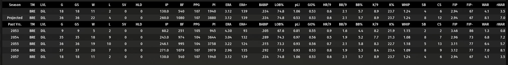
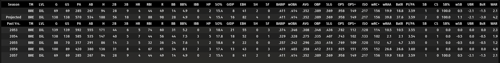

# Introduction

There's a lot to be said about trying to follow baseball from a boxscore. In real life, experts claim that looking at a box score doesn't provide any context, and that you lose all enjoyment of the game just by doing so. That without the context of watching how the players behave in the heat of the moment, the boxscore can be a lie. Unfortunately, the box scores (and other stats) is all we have in evaluating player performance in OOTP.

Before we can get into the meat of the stats and modelling, I'd like to talk about views.

# Views

One of the saving graces of OOTP is the ability to customize the information on the screen. A great tutorial for this can be found [here](https://www.youtube.com/watch?v=lcPsO4mQT_o). Especially important is the ability to customize the default information that is shown when selecting players. 

Views can be seen as a Business Intelligence tool i.e. dashboards. I think it's a good way of thinking as you get deeper into the game as to what information you want surfaced on what screen.

A few of the abnormalities from standard views that I like are

## Pitching

An example view from PT

A few fields to highlight are

 - BABIP
 - LOB%
 - rWAR
 - Rates

### BABIP & LOB%

BABIP and LOB% are measures of how "lucky" or alternatively the impact of defense behind the pitcher. There's no absolute value that can definitely say this is good or bad, but more along the lines when observed holistically compared to the rest of the league to help characterize the pitcher's performance. Generally, in most "modern" (i.e. 2010) settings, a BABIP around .300 is normal, thus, if a pitcher has a BABIP below .300 they're likely over performing due to luck (or have a really high Pitcher BABIP rating). For LOB%, this is more subjective, however tied to rWAR, low LOB% would indicate that a pitcher has too many players on the base paths (due to poor fielders, poor luck, low control, or all of the above) and they have likely scored, increasing a pitchers RA/9 and thus lowering their rWAR.

### rWAR

This field is not shown by default, but is the RA/9 version of pitching WAR. The in-game WAR field is FIP based, which has it's flaws, especially when Pitcher BABIP is a rating that impacts a pitcher's value. If the intent of evaluating a pitcher is their run suppression, then I like to focus on rWAR over (f)WAR.

### Rates

I recently decided to look at rates for pitching (and batting) stats. I think historically, people were more focused on per 9 stats (K/9, BB/9, HR/9), however as I've focused more on modelling and aggregating data, I felt the per 9 stats cumbersome and prone to inaccuracies. This is because better pitchers typically face fewer batters so the unit of per 9 innings in the denominator doesn't necessarily capture the relationship of the pitcher ratings to the observed outcomes. I believe the in game engine models the ratings closer to a percentage based on the number of batters faced.

A general (and not entirely accurate description to be expanded upon later) example is someone with 128/128 Stuff rating may have a K% of 30%. Depending on the amount of outs recorded in 10 innings pitched we can have a variety of K/9 ratings

| Batters faced |  K/9 |
|---------------|------|
| 30            |  8.1 |
| 45            | 12.2 |
| 60            | 16.2 |

The minimum amount of batters a pitcher could face in 10 innings is 30 batters, so a K/9 may inflate that number just because they faced twice as many batters during this 10 inning period. Why did they face so many extra batters? Presumably to be able to face that many extra batters must mean that they've given up more (potentially unearned) runs?

The rates themselves provide a clearer relationship between the ratings and the observed outcomes of the game.

## Batting

 - rates

*TODO*

# Exports

Before we can talk about modelling, watch [this]https://www.youtube.com/watch?v=WdKCxJlHZq4&t=2011s) video first.

The game client allows you to export an HTML view of the report views that you generate (on most pages). This is a key component of compiling and aggregating the in game stats to better observe performance trends across players.

*TODO*